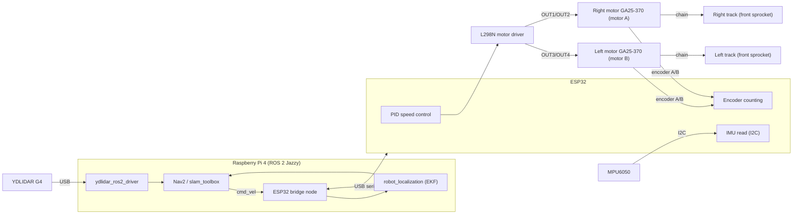

# Autonomous Tracked Robot (ROS 2 Jazzy)

An autonomous tracked (skid-steer) mobile robot built around a Raspberry Pi 4 running ROS 2 Jazzy, with an ESP32 acting as the low-level controller for the motors, encoders and IMU. The two tracks are chain-driven by sprockets at the front. A YDLIDAR G4 provides 360° laser scans for mapping and navigation.

> Items marked **TBD** depend on your exact parts or wiring and need to be filled in.

## Table of contents

- [System overview](#system-overview)
- [Hardware components](#hardware-components)
- [Wiring](#wiring)
- [Repository layout](#repository-layout)
- [Software architecture](#software-architecture)
- [ROS 2 interfaces](#ros-2-interfaces)
- [Setup](#setup)
- [Running the robot](#running-the-robot)
- [Calibration](#calibration)
- [Known limitations](#known-limitations)
- [Roadmap](#roadmap)

## System overview

The system is split into two layers:

- **High level (Raspberry Pi 4):** runs ROS 2 Jazzy. Handles the lidar driver, odometry, sensor fusion, SLAM and navigation.
- **Low level (ESP32):** handles everything timing-critical. Counts encoder pulses, runs the motor speed control loops, reads the IMU, and exchanges data with the Pi over USB serial.



## Hardware components

| Component | Model | Role | Interface |
|---|---|---|---|
| Main computer | Raspberry Pi 4 (Ubuntu 24.04, 64-bit) | ROS 2 host | - |
| Microcontroller | ESP32 | Motor control, encoder and IMU acquisition | USB serial to Pi |
| Drive | 2 tracks (chenille), chain-driven by front sprockets | Skid-steer locomotion | - |
| Motors | 2 x GA25-370 12 V DC gear motor with hall encoder | One per track | Via motor driver |
| Motor driver | L298N dual H-bridge module (large version, with heatsink) | Drives the two motors | ENA/ENB PWM + IN1-IN4 from ESP32 |
| Lidar | YDLIDAR G4 | 360° 2D laser scan | USB (serial adapter) to Pi |
| IMU | MPU6050 | 3-axis gyroscope + 3-axis accelerometer | I2C to ESP32 |
| Battery / regulators | **TBD** (12 V for the motors) | Power | - |

### Raspberry Pi 4

Runs the full ROS 2 stack. For best performance run it headless and use RViz on a separate computer on the same network.

### ESP32

Responsibilities:

- Quadrature decoding of both encoders (interrupts on both channels)
- Closed-loop sprocket speed control (one PID per side)
- Reading the MPU6050 over I2C, with gyro bias calibration at boot
- Serial link with the Pi: receives sprocket velocity targets, sends encoder counts and IMU data
- Safety timeout: stops the motors if no command arrives within 500 ms

### Motors: GA25-370 with encoder

DC gear motor with a two-channel (quadrature) hall encoder on the motor shaft, before the gearbox.

| Parameter | Value |
|---|---|
| Rated voltage | 12 V |
| No-load output speed | 620 RPM at 12 V |
| Gear ratio | 15.5:1 (measured about 16 by hand-turn calibration; datasheet options 15.5:1 or 20.4:1) |
| Encoder pulses per motor revolution | 11 per channel |
| Counts per motor revolution | 44 (11 x 4, full quadrature) |
| Counts per output shaft revolution | 682 (44 x 15.5) |

Motor connector colors:

| Wire | Function | Connect to |
|---|---|---|
| Red | Motor power + | L298N output terminal |
| White | Motor power - | L298N output terminal |
| Black | Encoder GND | GND |
| Blue | Encoder VCC | 3.3 V |
| Green | Encoder channel A | ESP32 (see [Wiring](#wiring)) |
| Yellow | Encoder channel B | ESP32 (see [Wiring](#wiring)) |

Encoder resolution and gear ratio were measured with [tools/motor_encoder_control.py](tools/motor_encoder_control.py) (a Pi-only bench test, see [Bench test on the Pi](#bench-test-on-the-pi)). Calibrate by turning the output shaft by hand with the motor unpowered: brush noise while the motor runs inflates the counts.

### Motor driver: L298N

The large L298N module (red board, heatsink, screw terminals).

- Remove the **ENA and ENB jumpers** so the ESP32 can PWM those pins for speed control.
- PWM frequency is set to 1 kHz. The L298N's bipolar transistors switch slowly, so high frequencies (e.g. 20 kHz) reduce torque and heat the chip.
- The L298N drops about 2 V, so the motors see about 10 V from a 12 V battery and top out below the 620 RPM rating.
- With a 12 V supply, leave the **5 V-EN jumper** on: the onboard regulator powers the driver logic. Do not feed 5 V into the 5 V terminal at the same time.
- ESP32 3.3 V logic is enough for the L298N inputs (IN1-IN4, ENA, ENB).

### YDLIDAR G4

| Parameter | Value |
|---|---|
| Type | 360° 2D triangulation lidar |
| Range | approx. 0.1 to 16 m |
| Scan frequency | 5 to 12 Hz |
| Sample rate | up to 9000 samples/s |
| Serial baud rate | 230400 |

The G4 needs more current at startup than a Pi USB port reliably supplies. Power it through the auxiliary power input on its USB adapter board from a separate 5 V supply.

### IMU: MPU6050

| Parameter | Value |
|---|---|
| Sensor | InvenSense MPU6050 |
| Axes | 3-axis gyroscope + 3-axis accelerometer (no magnetometer) |
| Configured range | Gyro ±500 °/s, accelerometer ±2 g |
| Low-pass filter | 44 Hz |
| Interface | I2C, address 0x68 (0x69 if AD0 is high) |
| Module supply | 3.3 V or 5 V on most breakout boards (onboard regulator) |

The gyro's yaw rate is what keeps the heading accurate: tracks slip sideways whenever the robot turns, so the encoders alone give a poor heading. The firmware measures the gyro bias at boot, so **keep the robot still for about 1 second after power-up or reset**.

Mount the board flat with its X axis pointing forward and Z up, or update `imu_joint` in the URDF to match.

## Wiring

ESP32 pin assignment (set in [firmware/esp32/include/config.h](firmware/esp32/include/config.h)). Motor A is the right track and motor B the left, as in the bench-test script.

| Signal | ESP32 pin | Notes |
|---|---|---|
| ENA (right motor speed, PWM) | GPIO 18 | ENA jumper removed |
| IN1 / IN2 (right motor direction) | GPIO 19 / 23 | |
| ENB (left motor speed, PWM) | GPIO 14 | ENB jumper removed |
| IN3 / IN4 (left motor direction) | GPIO 27 / 13 | |
| Right encoder A (green) / B (yellow) | GPIO 32 / 33 | Internal pull-ups enabled |
| Left encoder A (green) / B (yellow) | GPIO 25 / 26 | Internal pull-ups enabled |
| MPU6050 SDA / SCL | GPIO 21 / 22 | Default ESP32 I2C pins |
| Serial to Pi | USB | Appears as `/dev/ttyUSB*` or `/dev/ttyACM*` |

Pins were chosen to avoid the ESP32 strapping pins (0, 2, 5, 12, 15), the flash pins (6-11) and the input-only pins (34-39), which have no pull-ups.

Wiring notes:

- **Logic levels:** ESP32 GPIOs are 3.3 V and not 5 V tolerant. Power the encoders (blue wire) from 3.3 V, as in the bench test, so channels A and B stay at 3.3 V.
- **Encoder noise:** brushed motors inject noise into the encoder lines. Keep encoder wires away from the motor wires, and solder a 100 nF ceramic capacitor across each motor's terminals if counts jump while the motor runs.
- **Common ground:** the Pi, ESP32, L298N and battery negative must all share ground.
- **Motor power:** motors are powered from the 12 V battery through the L298N, never from the Pi or ESP32 pins.

### Bench test on the Pi

[tools/motor_encoder_control.py](tools/motor_encoder_control.py) drives the motors and reads the encoders directly from the Pi's GPIO with `gpiozero`, without the ESP32. It was used to confirm the wiring and measure the gear ratio. Its pin mapping (BCM numbering):

| Signal | Physical pin | Pi GPIO |
|---|---|---|
| ENA (motor A speed) | 33 | GPIO13 |
| ENB (motor B speed) | 32 | GPIO12 |
| IN1 / IN2 (motor A) | 36 / 38 | GPIO16 / GPIO20 |
| IN3 / IN4 (motor B) | 40 / 37 | GPIO21 / GPIO26 |
| Motor A encoder green (A) / yellow (B) | 16 / 18 | GPIO23 / GPIO24 |
| Motor B encoder green (A) / yellow (B) | 13 / 11 | GPIO27 / GPIO17 |
| Encoder VCC (blue) / GND (black) | 3.3 V / GND | |

On the robot, these signals move to the ESP32 pins above.

## Repository layout

```
firmware/esp32/              PlatformIO project for the ESP32
  include/config.h           pins, encoder resolution, PID gains (edit for your hardware)
  src/main.cpp               encoders, PID, MPU6050, serial protocol
ros2_ws/src/
  robot_bridge/              Python node: /cmd_vel -> ESP32, ESP32 -> /wheel/odom, /imu/data_raw, /joint_states
  robot_description/         URDF (xacro) and an RViz view
  robot_bringup/             launch files and config (bridge, lidar, EKF, slam_toolbox, Nav2)
  ydlidar_ros2_driver/       cloned by the install script (not tracked in git)
maps/                        saved maps
scripts/install_deps.sh      installs and builds everything
tools/motor_encoder_control.py  Pi-only motor and encoder bench test (gpiozero)
udev/99-robot.rules          stable /dev/ydlidar and /dev/esp32 names
```

## Software architecture

| Layer | Package / component | Purpose |
|---|---|---|
| Firmware | ESP32 firmware (this repo) | Encoders, PID, IMU, serial protocol |
| Bridge | `robot_bridge/esp32_bridge` | `cmd_vel` to sprocket speeds (skid-steer kinematics), serial data to track odometry and IMU topics |
| Lidar | `ydlidar_ros2_driver` + YDLidar-SDK | Publishes `/scan` |
| Description | URDF + `robot_state_publisher` | Robot model and static transforms |
| Fusion | `robot_localization` | EKF fusing track odometry and gyro yaw rate into `odom -> base_link` |
| Mapping | `slam_toolbox` | Builds the map, publishes `map -> odom` |
| Navigation | Nav2 | Path planning and obstacle avoidance |

Two options for the Pi to ESP32 link:

1. **micro-ROS:** the ESP32 publishes and subscribes to ROS 2 topics directly through a micro-ROS agent on the Pi.
2. **Custom serial protocol:** a simple packet format, with a ROS 2 node or `ros2_control` hardware interface on the Pi.

Chosen approach: **custom serial protocol** (ASCII lines at 115200 baud), handled by the `esp32_bridge` node.

| Direction | Message | Meaning |
|---|---|---|
| Pi -> ESP32 | `V <left> <right>` | Sprocket velocity targets in rad/s (sent at 20 Hz) |
| Pi -> ESP32 | `P <kp> <ki> <kd> <kf>` | Set PID gains for both sides |
| Pi -> ESP32 | `R` | Reset encoder counts |
| ESP32 -> Pi | `E <left_ticks> <right_ticks> <ax> <ay> <az> <gx> <gy> <gz>` | Cumulative encoder counts, acceleration in m/s², angular rate in rad/s (50 Hz) |
| ESP32 -> Pi | `I <text>` | Informational message, logged by the bridge |

## ROS 2 interfaces

### Topics

| Topic | Type | Source | Description |
|---|---|---|---|
| `/cmd_vel` | `geometry_msgs/msg/Twist` | Nav2 / teleop | Velocity command |
| `/scan` | `sensor_msgs/msg/LaserScan` | Lidar driver | Laser scan |
| `/wheel/odom` | `nav_msgs/msg/Odometry` | Bridge | Raw track odometry |
| `/imu/data_raw` | `sensor_msgs/msg/Imu` | Bridge | Angular velocity and linear acceleration |
| `/odometry/filtered` | `nav_msgs/msg/Odometry` | `robot_localization` | Fused odometry |
| `/joint_states` | `sensor_msgs/msg/JointState` | Bridge | Sprocket angles, for the robot model |
| `/map` | `nav_msgs/msg/OccupancyGrid` | `slam_toolbox` | Occupancy map |

The MPU6050 has no magnetometer and no onboard fusion, so the IMU message has its orientation covariance first element set to `-1` (orientation not provided). The EKF uses its yaw rate (`vyaw`); the track odometry provides forward velocity only.

### TF tree

```
map -> odom -> base_link -> laser_frame
                         -> imu_link
                         -> left_track,  left_sprocket,  left_idler
                         -> right_track, right_sprocket, right_idler
```

### Robot parameters

| Parameter | Value |
|---|---|
| Effective sprocket radius | **TBD** m (placeholder 0.02). Track travel per radian of the motor output shaft: the track sprocket's pitch radius times any chain reduction between motor and sprocket |
| Track separation (center to center) | **TBD** m (placeholder 0.15) |
| Turn slip factor | **TBD**, calibrated (placeholder 1.0) |
| Encoder counts per sprocket revolution | 682 |
| Max sprocket speed | 60 rad/s, firmware limit (620 RPM no-load = 64.9 rad/s) |
| Max linear speed | 0.4 m/s (bridge limit) |
| Max angular speed | 1.5 rad/s (bridge limit) |

`base_link` is on the ground at the center of the two tracks' contact patches, which is the turning center of a skid-steer robot.

## Setup

### 1. ROS 2 Jazzy and dependencies

The Pi runs Ubuntu 24.04 with ROS 2 Jazzy installed from apt. Then run:

```bash
./scripts/install_deps.sh
```

It installs the ROS packages (xacro, robot_localization, slam_toolbox, Nav2, teleop), adds you to the `dialout` group, installs the udev rules, builds the YDLidar SDK, clones the lidar driver, installs PlatformIO and builds the workspace. Log out and back in afterwards so the `dialout` group applies.

Then add to `~/.bashrc`:

```bash
source /opt/ros/jazzy/setup.bash
source ~/TSYP_robot/ros2_ws/install/setup.bash
alias pio=~/.platformio-venv/bin/pio
```

To rebuild the workspace later:

```bash
cd ~/TSYP_robot/ros2_ws
CMAKE_PREFIX_PATH=~/.local:$CMAKE_PREFIX_PATH LIBRARY_PATH=~/.local/lib colcon build --symlink-install --parallel-workers 2
```

### 2. Lidar driver

Handled by the install script. Notes:

- The YDLidar SDK is installed to `~/.local` (no root needed), so the workspace build needs `CMAKE_PREFIX_PATH` and `LIBRARY_PATH` pointing there.
- Use the driver's `humble` branch. `master` uses an older rclcpp API and does not compile on Jazzy.
- G4 parameters (baud rate 230400) are in `ros2_ws/src/robot_bringup/config/ydlidar_g4.yaml`.

### 3. Stable device names

With two USB serial devices, the `/dev/ttyUSB*` numbering can change between boots. The udev rules in `udev/99-robot.rules` give each device a fixed name (`/dev/ydlidar`, `/dev/esp32`). They use the usual chip IDs (CP2102 for the G4 adapter, CH340 for the ESP32). Confirm the IDs with `lsusb`, edit the file if needed, copy it to `/etc/udev/rules.d/` and reload with `sudo udevadm control --reload-rules && sudo udevadm trigger`.

### 4. ESP32 firmware

Pins, gear ratio and motor directions are in `firmware/esp32/include/config.h`. Then:

```bash
cd firmware/esp32
pio run                                     # build
pio run -t upload --upload-port /dev/esp32  # flash
pio device monitor -p /dev/esp32            # should print "I boot imu=ok", then "E ..." lines
```

## Running the robot

```bash
# 1. Base: robot description, ESP32 bridge, EKF and lidar (use_lidar:=false to skip the lidar)
ros2 launch robot_bringup bringup.launch.py

# 2. Teleoperation (for testing and mapping)
ros2 run teleop_twist_keyboard teleop_twist_keyboard

# 3. Mapping, then save the map
ros2 launch robot_bringup slam.launch.py
ros2 run nav2_map_server map_saver_cli -f ~/TSYP_robot/maps/my_map

# 4. Navigation with a saved map (instead of step 3)
ros2 launch robot_bringup navigation.launch.py map:=$HOME/TSYP_robot/maps/my_map.yaml

# View the model only (on a machine with a display)
ros2 launch robot_description display.launch.py
```

The lidar can also be started on its own with `ros2 launch robot_bringup lidar.launch.py`.

## Calibration

Robot parameters live in three places that must agree: `firmware/esp32/include/config.h`, `ros2_ws/src/robot_bringup/config/robot.yaml` and `ros2_ws/src/robot_description/urdf/robot.urdf.xacro`.

1. **Encoder counts:** turn a sprocket exactly one turn by hand (motor unpowered) and confirm about 682 counts. Already done for the gear ratio with the bench-test script.
2. **Directions:** with the robot lifted, send a small forward command. Both tracks should move forward (otherwise set `LEFT_MOTOR_INVERT` / `RIGHT_MOTOR_INVERT`) and both encoder counts should go up (otherwise set `LEFT_ENC_INVERT` / `RIGHT_ENC_INVERT`). Mirrored motors usually count in opposite directions, so expect to invert one encoder.
3. **Sprocket radius:** drive 1 m in a straight line and compare with `/wheel/odom`. Scale `sprocket_radius` by actual / reported distance.
4. **Turn slip factor:** spin the robot 360° in place on the floor you will use. Compare with the yaw computed from `/wheel/odom` alone: with `turn_slip_factor` at 1.0, set it to encoder-reported angle / 360°. Tracks typically need 1.2 to 2. This makes commanded turn rates accurate; the EKF takes heading from the gyro anyway.
5. **PID tuning:** tune each side's speed loop with the tracks off the ground first, then on the ground. Gains can be changed live by sending `P <kp> <ki> <kd> <kf>` over serial. The L298N needs a minimum PWM before the tracks move, which the integral term has to overcome.
6. **IMU orientation:** rotate the robot left (counter-clockwise from above). `/imu/data_raw` `angular_velocity.z` must be positive. If not, fix the board orientation or `imu_joint` in the URDF.
7. **Lidar transform:** measure the lidar position and orientation relative to `base_link` and set it in the URDF.

## Known limitations

- **Track slip.** Skid-steer tracks slide sideways in every turn, and the amount depends on the floor. Encoder odometry is only trusted for forward speed; heading comes from the gyro, and slam_toolbox / AMCL correct the remaining drift with the lidar.
- **Gyro drift.** The MPU6050 has no magnetometer, so the integrated heading slowly drifts. The boot-time bias calibration reduces this; the lidar-based localization corrects it.
- **L298N losses.** About 2 V drop and significant heat at high current. A MOSFET driver (e.g. TB6612FNG, BTS7960) would be more efficient.
- **Pi 4 compute budget.** SLAM and Nav2 together are demanding. Reduce map resolution, costmap update rates and controller frequency if the CPU saturates.

## Roadmap

- [x] ESP32 firmware: encoder counting and PID speed control (written and compiles, untested on hardware)
- [x] Pi to ESP32 serial link (bridge node tested against a simulated ESP32)
- [x] URDF and TF tree (placeholder dimensions)
- [ ] Track odometry verified
- [ ] Lidar publishing `/scan`
- [ ] EKF configured
- [ ] Mapping with `slam_toolbox`
- [ ] Autonomous navigation with Nav2

## License

**TBD**